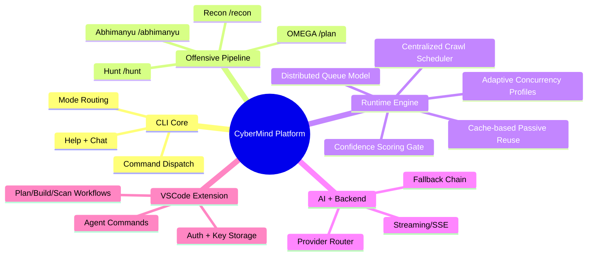

# CyberMind

AI-powered offensive security CLI with Linux-first autonomous pipelines, cross-platform AI chat, and integrated coding workflows.

## What CyberMind Is

CyberMind is a real execution pipeline, not just prompt wrappers:
- `/plan` (OMEGA) builds strategy from live target context
- `/recon` executes multi-phase surface discovery and normalization
- `/hunt` runs deep web/app vulnerability hunting with context chaining
- `/abhimanyu` executes exploit/post-exploit paths with session persistence
- `/doctor` keeps toolchain stable and self-healing

## Quick Start

```bash
curl -sL https://cybermindcli1.vercel.app/install.sh | bash
cybermind --key cp_live_xxxxx
cybermind /doctor
cybermind /plan target.com
```

## Architecture Overview



## Execution Dataflow

```mermaid
flowchart LR
  A[/plan] --> B[Target Classification + Passive Intel]
  B --> C[/recon]
  C --> D[Surface Graph: subdomains + ports + URLs + tech]
  D --> E[/hunt]
  E --> F[Validated Findings + Confidence Score]
  F --> G[/abhimanyu]
  G --> H[Session Artifacts + Evidence]
  H --> I[Report + AI Summary]
```

## Fast Engine (Now Implemented)

The CLI engine includes full-stack speed/brain upgrades:

- **Adaptive concurrency profiles**: dynamic per-mode/per-target worker tuning
- **Centralized crawl scheduler**: deduped URL task scheduling across phases
- **Cache-based passive reuse**: passive outputs reused via TTL cache
- **Distributed queue model**: persisted queue for cross-phase orchestration
- **Confidence scoring before exploit**: exploit-stage gating based on finding quality

These are integrated directly in:
- `cli/recon/engine.go`
- `cli/hunt/engine.go`
- `cli/abhimanyu/engine.go`
- `cli/pipeline/optimizer.go`

## Command and Module Map

```mermaid
flowchart TB
  subgraph CLI
    MAIN[main.go]
    HELP[help + command parser]
  end

  subgraph Modes
    P[/plan]
    R[/recon]
    H[/hunt]
    A[/abhimanyu]
    D[/doctor]
  end

  subgraph Runtime
    AP[Adaptive Profile]
    CS[Crawl Scheduler]
    PC[Passive Cache]
    DQ[Distributed Queue]
    CG[Confidence Gate]
  end

  MAIN --> P
  MAIN --> R
  MAIN --> H
  MAIN --> A
  MAIN --> D
  P --> R --> H --> A
  R --> AP
  H --> AP
  R --> CS
  H --> CS
  R --> PC
  H --> PC
  R --> DQ
  H --> DQ
  A --> DQ
  H --> CG
  CG --> A
```

## Platform Capability Matrix

| Capability | Linux/Kali | Windows | macOS |
|---|---|---|---|
| AI Chat | Yes | Yes | Yes |
| `/plan` | Yes | No | No |
| `/recon` | Yes | No | No |
| `/hunt` | Yes | No | No |
| `/abhimanyu` | Yes | No | No |
| `/doctor` | Yes | Yes | Yes |

## Documentation Hub

- [`docs/ARCHITECTURE.md`](./docs/ARCHITECTURE.md)
- [`docs/PIPELINE_AUDIT.md`](./docs/PIPELINE_AUDIT.md)
- [`docs/VSCODE_EXTENSION_FULLSTACK.md`](./docs/VSCODE_EXTENSION_FULLSTACK.md)
- [`CYBERMIND_UPGRADE_PLAN.md`](./CYBERMIND_UPGRADE_PLAN.md)

## Reference Visualization Sources

For architecture deep-dives and map views:

- [CyberMind Code Wiki Root](https://codewiki.google/github.com/thecnical/cybermind#ai-powered-offensive-security-cli)
- [CLI Core and Command Dispatch](https://codewiki.google/github.com/thecnical/cybermind#ai-powered-offensive-security-cli-cli-core-and-command-dispatch)
- [Self Updating Mechanism](https://codewiki.google/github.com/thecnical/cybermind#ai-powered-offensive-security-cli-self-updating-mechanism)
- [Tool Management and Health Checks](https://codewiki.google/github.com/thecnical/cybermind#ai-powered-offensive-security-cli-tool-management-and-health-checks)
- [AI Chat and UI](https://codewiki.google/github.com/thecnical/cybermind#ai-chat-and-user-interface)
- [UI State Management](https://codewiki.google/github.com/thecnical/cybermind#ai-chat-and-user-interface-ui-state-management-and-interaction)
- [UI Rendering and Styling](https://codewiki.google/github.com/thecnical/cybermind#ai-chat-and-user-interface-ui-rendering-and-styling)
- [Recon and Hunt Orchestration](https://codewiki.google/github.com/thecnical/cybermind#cybersecurity-reconnaissance-and-vulnerability-hunting-orchestration)
- [Phased Execution and Dataflow](https://codewiki.google/github.com/thecnical/cybermind#cybersecurity-reconnaissance-and-vulnerability-hunting-orchestration-phased-execution-and-contextual-data-flow)
- [Tool Registry Orchestration](https://codewiki.google/github.com/thecnical/cybermind#cybersecurity-reconnaissance-and-vulnerability-hunting-orchestration-external-tool-orchestration-and-registry-management)
- [Findings Extraction and Aggregation](https://codewiki.google/github.com/thecnical/cybermind#cybersecurity-reconnaissance-and-vulnerability-hunting-orchestration-findings-extraction-processing-and-aggregation)
- [Backend API Communication](https://codewiki.google/github.com/thecnical/cybermind#cybermind-backend-api-communication)

## Screenshots

Place screenshots in `docs/images/` and link them:

```md


```

## Legal and Safety

- Run only on authorized targets and in-scope programs.
- Follow disclosure, rate-limit, and legal boundaries.
- Do not use for unauthorized access.

## License

MIT (`LICENSE`).
